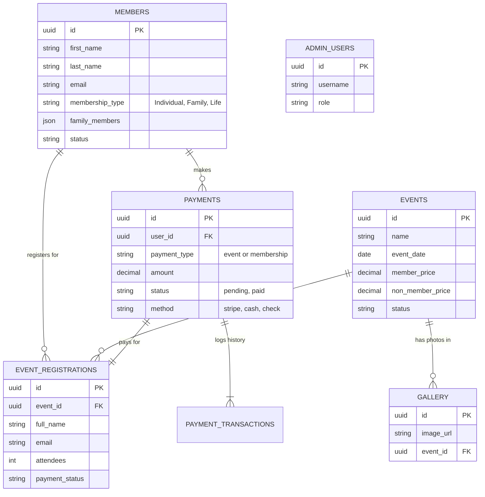

# TASJ Website Project Documentation

This document outlines the technical architecture, user stories, and technological choices for the Telugu Association of Southern Jersey (TASJ) website project.

---

## 1. User Stories

The application is designed around three key user roles: **General Visitor**, **Member**, and **Administrator**.

### 👤 General Visitor
- **View Events**: I want to browse upcoming cultural events so that I can decide which ones to attend.
- **Register for Events**: I want to register for events online (and pay if required) so that I can reserve my spot.
- **View Gallery**: I want to see photos from past events to understand the community culture.
- **Contact TASJ**: I want a simple form to send inquiries to the organization.
- **Become a Member**: I want to understand membership benefits and easily sign up/pay for membership online.

### 🌟 TASJ Member
- **Membership Management**: I want to register for "Individual", "Family", or "Lifetime" membership.
- **Member Discounts**: I want to receive automatic discounts on event registrations based on my membership status.
- **Profile Management**: I want to update my contact information and family member details (future feature).
- **Payment History**: I want to receive confirmation emails for my payments and registrations.

### 🛡️ Administrator
- **Event Management**: I want to create, update, and delete events, including setting ticket prices and member/non-member rates.
- **Member Management**: I want to view a list of all members, search by name, and manage their diverse membership types (Individual, Family, Life).
- **Registration Tracking**: I want to see who has registered for specific events and download the list (CSV) for check-in.
- **Payment Approval**: I want to manually approve "Cash/Offline" payments to mark registrations as paid.
- **Email System**: I want the system to automatically send professional confirmation emails for registrations and payments.
- **Settings Control**: I want to update site settings (contact info, pricing) without needing a developer.

---

## 2. Technical Framework & Versions

The application uses a modern **Headless Architecture**, separating the frontend (what users see) from the backend (data and logic).

### 🖥️ Frontend (Client-Side)
- **Framework**: **React.js (v18.2.0)** - A powerful library for building dynamic, interactive user interfaces.
- **Routing**: **React Router (v6.8.1)** - Manages navigation without page reloads (Single Page Application).
- **Styling**: **Vanilla CSS 3** - Custom, lightweight styling without heavy external libraries for maximum performance flexibility.
- **State Management**: **Context API** - Built-in React state management for handling user sessions and global settings.
- **Build Tool**: **React Scripts (CRA)** - Standard build pipeline for optimization.
- **Motion/Animations**: **Framer Motion (v10.0.1)** - For smooth, premium-feeling transitions.

### ⚙️ Backend (Server-Side & Data)
- **Platform**: **Supabase** - An open-source Firebase alternative providing a full backend suite.
- **Database**: **PostgreSQL** - A powerful, enterprise-grade relational database.
- **Authentication**: **Supabase Auth** - Secure user management system.
- **Serverless Logic**: **Supabase Edge Functions (Deno)** - Runs backend code (like sending emails) securely in the cloud without a dedicated server.

### 🔌 Integrations
- **Payments**: **Stripe** - Industry-standard payment processing for secure online transactions.
- **Email Service**: **Resend API** - High-deliverability email service for transactional emails (confirmations, welcomes).

---

## 3. Technology Choice: React vs. WordPress

We chose a custom **React + Supabase** architecture over a traditional CMS like WordPress. Here is the reasoning:

| Feature | ⚛️ Custom React App (Chosen) | 📝 WordPress (Traditional) |
| :--- | :--- | :--- |
| **Performance** | **Blazing Fast**. Loads the site once (SPA), then only fetches data. Instant transitions. | **Slower**. Reloads the entire page on every click. Can become sluggish with many plugins. |
| **Security** | **High**. Database is decoupled from the frontend. Minimal "surface area" for hackers. | **Lower**. WordPress is the #1 target for bots. Plugins often introduce vulnerabilities. |
| **Customization** | **Unlimited**. We built the specific logic TASJ needs (e.g., specific family vs individual pricing rules). | **Limited**. You often fight against the "Theme" or "Plugin" limitations to get exact features. |
| **Maintenance** | **Low**. Code is stable. No constant "plugin updates" that break the site. | **High**. Requires constant updates to core/plugins to stay secure, which often breaks functionality. |
| **Cost** | **Low**. Can be hosted for free/cheap on static hosts (Netlify/Vercel). Pay as you grow. | **Medium**. Requires dedicated PHP hosting which costs monthly. |
| **User Experience** | **Premium**. App-like feel with smooth animations and instant feedback. | **Standard**. Feels like a traditional "website" with page reloads. |

**Verdict**: For a community organization managing payments, members, and events, the **Security, Performance, and Custom Logic** of React + Supabase offers a far superior long-term value than a generic WordPress site.

---

## 4. Logical Database Structure (ER Diagram)

Below is the **Entity-Relationship Diagram**. This illustrates how data connects in the "Backend Brain" of the application.

### Simple Explanation:
1.  **Members** are the core users.
2.  **Events** are created by admins.
3.  **Event Registrations** link a *User* (or Guest) to an *Event*.
4.  **Payments** track money from *Members* or *Registrations*.
5.  **Gallery** and **Settings** are standalone content managed by admins.

### Key Connections Explained:

*   **Events ↔ Registrations**: One Event has many Registrations. When an admin deletes an event, the system knows how to handle the registrations (usually keeps them for records or warns).
*   **Payments ↔ Registrations**: A Registration is linked to a Payment. This allows the system to say "This user registered, but hasn't paid yet" (Pending) vs "Registered and Paid" (Confirmed).
*   **Members ↔ Membership Type**: The `membership_type` field dictates the rules for pricing. If a user is "Family", the system knows to charge `$100` instead of `$50`.

---

This document summarizes the professional, scalable, and secure technical foundation built for the TASJ website.
